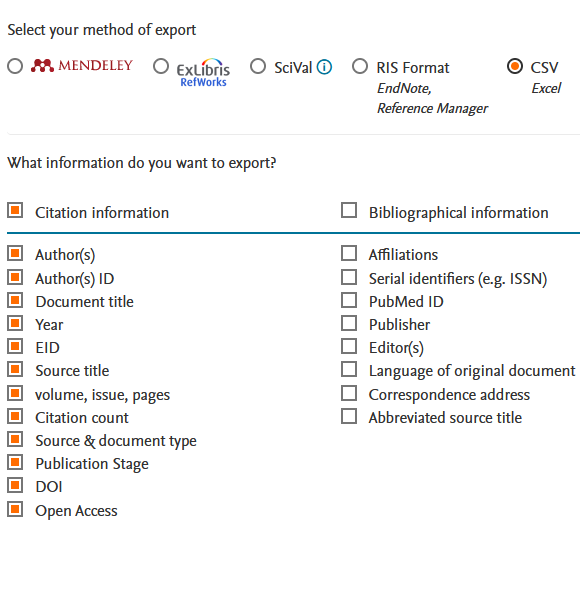

### this project is still work in progress

# scholar2scopus

L'Abilitazione Scientifica Nazionale fa riferimento a Scopus, una banca dati per riferimenti bibliografici privata ed inaccurata, per valutare i candidati. L'intento del repository e` di minimizzare il tempo di lavoro non-retribuito che i Dottori di Ricerca italiani (le S.V.) contribuiscono al miglioramento di questa banca dati.

## uso
1. scaricate la lista degli articoli che citano i vostri da Scopus, cosi`:
   1. Andate su "cited by", cliccate su "export all"

   
   2. Esportate in formato csv
   
   
2. opzionalmente, spostate il file risultante nella cartella dove volete eseguire il programma
3. installate python, se non l'avete gia`
4. ottenete una chiave API gratuita da [ScraperAPI](https://dashboard.scraperapi.com/signup)
   
5. eseguite le seguenti righe dalla cartella dove si trova il file con le citazioni:
```shell
    python3 -m venv venv
    source venv/bin/activate
    pip install git+https://github.com/hide-ous/scholar2scopus.git
    python -m scholar2scopus.cli --author="Your Name" --scraper_api_key="THE_API_KEY"
```


